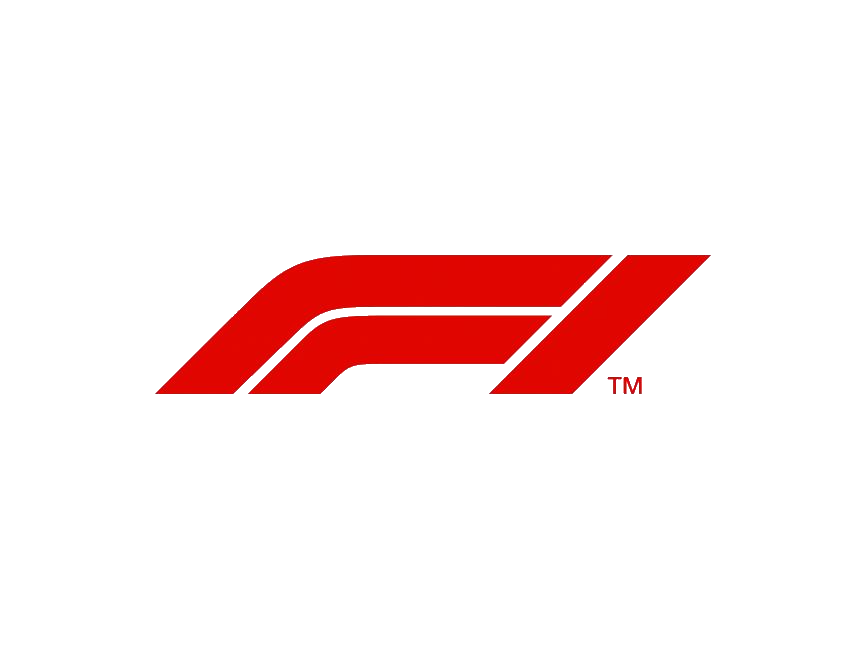

# ***Race To Victory*** 

## ***Game Intro***
**Game designed for **F1** fans to test their knowledge in three different catogories Drivers, Circuits and Teams, it's similar to hangman game "F1 Version"**

### Planing Material

[PlaningREADME.md](https://github.com/qassimalhamad/RaceToVictory/blob/main/planingREADME.md)


## How to Play?
Question will be answered in steps 

1. Choose the **category** you'd like to test your knowledge in.

	

2. Spaces will be displayed based on the category you seleceted. as shown bellow.

	

3. **Guess** the word, the word has the same letters amount as the spaces.

4. You have **5 chances** to guess the word, Try it by clicking on the letters buttons on the screen. if the letter you clicked is wrong you'll lose one of your chances!

	


5. Each time you clicked a wrong letter the image will change until you destory the f1 car!

	

6. Click on the restart button to reset the game on the same catogory! if you want to change catogory you can by clicking on one of the categories and restarting the game.


## Technical Part and Technologies used
* **JavaScript** 

```
const spotLetterGuessed = (letterGuessed) =>{
let found = false;
for(i = 0; i < randomWord.length; i++){
if(randomWord[i] === letterGuessed){
    arrayOfUnderScores[i] = letterGuessed;
    found = true;
    f1Audio.play()
    }
    }if(!found){
        count++
        crashAudio.play()
        chances.innerHTML = `You have ${maxCount-count} chances left`;
images.src = `images/projectImage-${count}.jpeg`;
    }
```
* **HTML**
``` 
<a href="https://www.formula1.com/">

</a>
<div class="categories">
<button class="categories-buttons">drivers</button>
<button class="categories-buttons">circuits</button>
<button class="categories-buttons">teams</button>
</div>
```
* **CSS**
```

@media only screen and (min-width: 390px) and (max-width:500px) {
    h1 { 
        text-align: center;
        color: white;
        text-transform: uppercase;
        padding: 1px;
        font-family: 'Raleway', sans-serif;
        font-weight: 100;
        font-size: 1.6rem;
        position: relative;
    }
```

## **Attribution**
[Images](https://gemini.google.com/): Link to the website I took images from
	
[Audio](https://pixabay.com/sound-effects/search/car-crash/): Link to the website I took audio from

## Next Step
Next Step could include adding more features to the website such as **having image for each driver,circuit and teams and link them after the player wins**, having a better **CSS** and we may use **keyDown** rather clicking on the butttons created