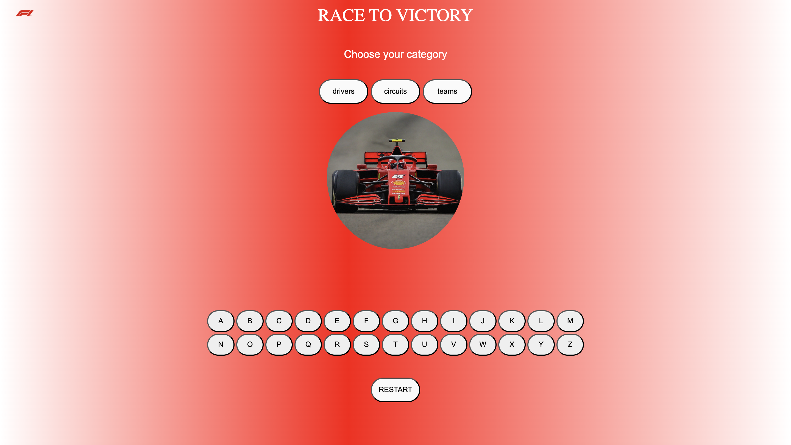
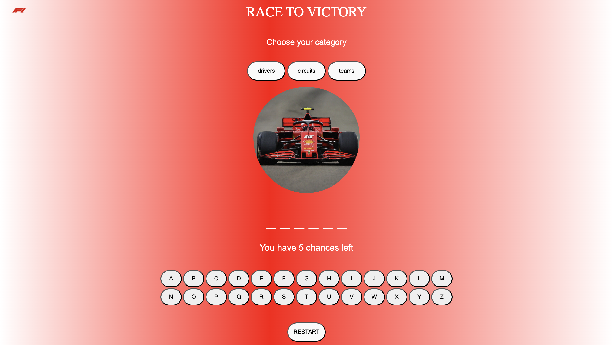
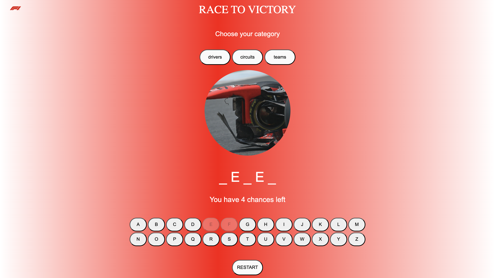
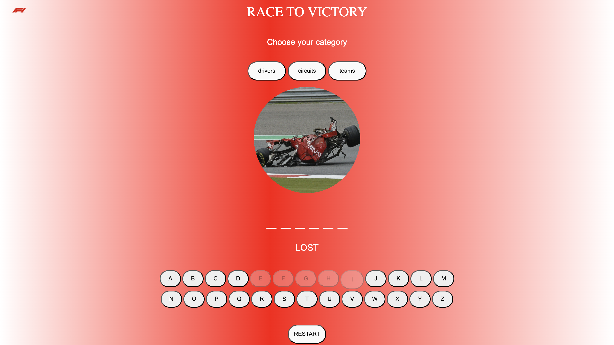

# ***Race To Victory*** 

## ***Game Intro***
**Game designed for **F1** fans to test their knowledge in three different catogories Drivers, Circuits and Teams, it's similar to hangman game "F1 Version"*

## How to Play?
Question will be answered in steps 

1. Choose the **category** you'd like to test your knowledge in.

	

2. Spaces will be displayed based on the category you seleceted. as shown bellow.

	

3. **Guess** the word, the word has the same letters amount as the spaces.

4. You have **5 chances** to guess the word, Try it by clicking on the letters buttons on the screen. if the letter you clicked is wrong you'll lose one of your chances!

	

5. Each time you clicked a wrong letter the image will change until you destory the f1 car!

	

6. Click on the restart button to reset the game on the same catogory! if you want to change catogory you can by clicking on one of the categories and restarting the game.

## Technical Part

<!-- ## USER STORY:

* As a user, I want to see the name of the game as a heading.
* As a user, I want the number of attempts left to be displayed on the screen.
* As a user, I want to see the letters I’ve chosen before.
* As a user, I want to see if I won or lost.
* As a user, I want a restart button to restart the game. -->

<!-- 
## PSEUDOCODE: 

1. The computer chooses a random word from the data and displays lines based on the length of the word.
2. Hangman images will appear on the left side, each wrong letter chosen will result in losing one chance, and the image will change.
3. The user has 6 chances to guess the word, or they will be hanged. -->

<!-- ## Plan:

	<!-- Create GitHub repo with files -->

<!-- ### HTML:
* Heading: Heading of the Game, "Hangman”.
		Alphabet Buttons: Buttons for each letter from a-z.
* Restart Button: Button for restarting the game.

* chances Display: A paragraph element to keep the remaining chances used and chances left.

* Hangman Image: Image selection for Hangman images and changes depending on chances remaining.
	
	
	
	
	
	
### JavaScript:

* Store Words in an array
* Random word picker 
* Initialization
* EventListener for the Guesses and restart button
* Functions for guessing, checking if matching letters are available and replace them and if not decrease the chances left 
* Update display for the words correctly guessed and the chances remaining 
* Check winning, if the empty array matches the word that's been picked randomly and the count of chances are still not max you win, if the cout of chancesLeft are maximum "6" you lost the game. --> -->